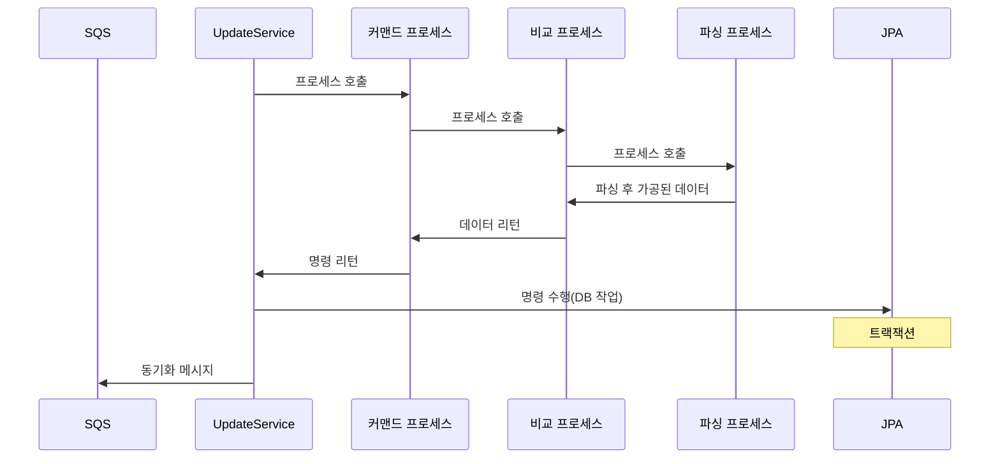
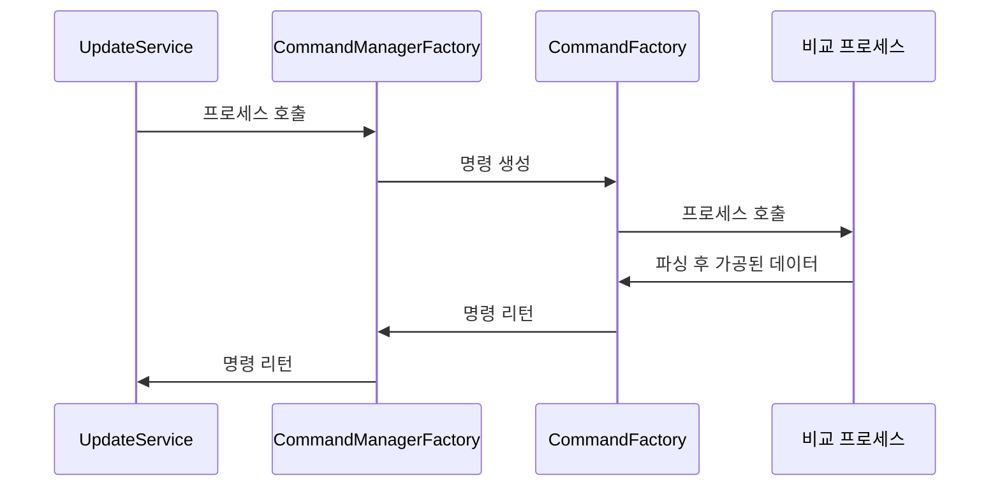
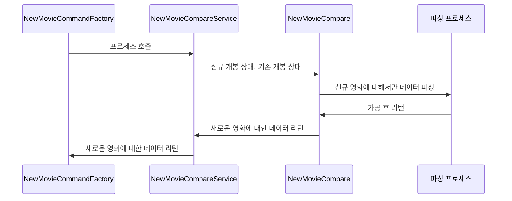
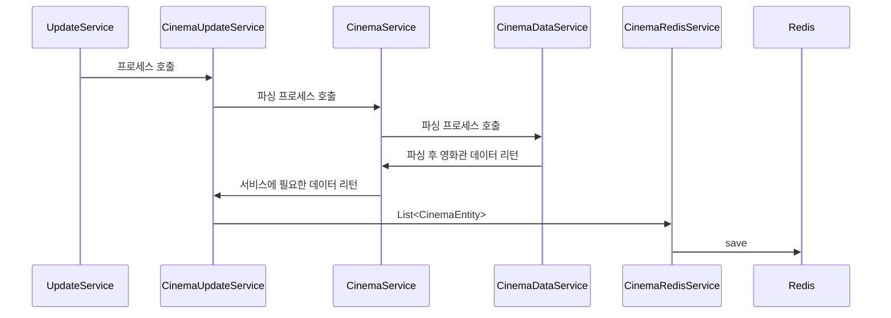

## **📌 개요**

- **프로젝트 명칭:** REMOVIE
- **개발 인원:** 1명
- **개발 기간:** 2024.09 - 2025.01

## **📌 설명**

Removie는 **재개봉 영화 알림 서비스** 입니다.

- 기존 영화관에서 다시 보고 싶은 영화가 **재개봉하면 알림**을 받을 수 있음
- **재개봉 영화 리스트**와 **최신 개봉 영화 순위** 확인 가능

## **📌 참고 사항**
- **REMOVIE는 KOBIS(영화관입장통합전산망) 스크래핑 프로젝트 입니다**
- **따라서 데이터 이용에 사전 허락을 구하였습니다**
- **공개 리포지토리에서 KOBIS 관련 민감한 코드 블록 처리 하였습니다**

## **📌 인프라**

# 백엔드 서버

## **✅ 주요 기능**

1. API 통신
2. 클라이언트 버전 동기화
3. 랭킹 동기화 및 최적화
4. 재개봉 영화 FCM

## **⚙️ 개발 환경**

#### **개발 언어**

- Java 21

#### **프레임워크 & 라이브러리**

- Spring Boot 3.3
- Spring JPA
- Spring Security
- Redis 

#### **데이터베이스**

- MySQL

#### **배포 환경**

- AWS EC2
- AWS ECR
- GitHubAction
- Docker

#### **알림 & 외부 서비스**

- Firebase FCM (푸시 알림)

#### **개발 도구**

- IntelliJ IDEA
- Gradle

## API 엔드 포인트

| HTTP Method | 엔드포인트                          | 요청 파라미터                                         | 설명                           |
| ----------- | ------------------------------ | ----------------------------------------------- | ---------------------------- |
| **GET**     | `/release/info`                | 없음                                              | 최신 개봉 상태를 불러 옵니다.            |
| **GET**     | `/cinema/{movieCode}`          | `movieCode` (PathVariable)                      | 대상 영화에 상영관 리스트를 불러옵니다.       |
| **GET**     | `/movie/info/sync`             | `version` (RequestParam)                        | 버전에 따른 동기화에 필요한 데이터를 불러 옵니다. |
| **GET**     | `/movie/info`                  | `movieCode` (RequestParam, List)                | 영화에 정보들을 불러 옵니다.             |
| **GET**     | `/movie/info/{movieTitle}`     | `movieTitle` (PathVariable)                     | 영화 제목에 맞는 영화 정보들을 불러 옵니다.             |
| **GET**     | `/movie/info/page`             | `offset` (RequestParam), `limit` (RequestParam) | 랭킹 구간에 영화 정보들을 불러 옵니다.       |
| **GET**     | `/movie/info/date/{movieCode}` | `movieCode` (PathVariable)                      | 대상 영화에 상영 날짜를 불러 옵니다.        |

# 코어 서버

## **✅ 주요 기능**

1. 영화 데이터 파싱
2. DB 쓰기 작업
3. Redis 쓰기 작업

## **⚙️ 개발 환경**

#### **개발 언어**

- Java 21

#### **프레임워크 & 라이브러리**

- Spring Boot 3.3
- Spring JPA 
- Redis

#### **데이터베이스**

- MySQL 

#### **인프라 & 배포 환경**

- AWS EC2
- AWS ECR
- GitHubAction
- Docker

#### **개발 도구**

- IntelliJ IDEA
- Gradle

## **프로세스**

- **프로세스는 4가지로 구성됨**
  - 커맨드 프로세스
  - 비교 프로세스
  - 파싱 프로세스
  - 상영관 프로세스

# 커맨드 프로세스

**목적**

- 파싱된 최종 데이터를 모아 JPA 트랜잭션을 콜 체인의 최상단으로 유지

**📌 `CommandFactory`**

- **커맨드를 생성하는 객체**
- `NewMovieCommandFactory`, `RetireMovieCommandFactory` 등 존재
- 비교 프로세스로 부터 명령 수행에 주체가 되는 값 불러옴
- 명령을 수행하는데 필요한 DI 주입

# 비교 & 파싱 프로세스

- **모든 `MovieCompare` 객체는 `MovieService`를 통해 통신 됨** -> 변경에 대한 전파를 차단하기 위함.

- **NewMovieCompare 은 추가적인 파싱 과정 포함** -> 신규 영화에 대한 파싱 작업.

# 상영관 프로세스

### **📌 Redis 사용 이유**

1. **하루 단위로 유지하는 데이터 특성**
    
    - 지속적인 수정 작업 발생 → **DB 오버헤드 증가 방지**
    - **코어 서버 & 백엔드 서버가 DB를 공유** → 충돌 방지
2. **클라이언트 캐싱 미지원**
    
    - 상영관 데이터는 클라이언트에서 캐시되지 않음
    - **Redis 사용으로 빠른 조회 가능**

